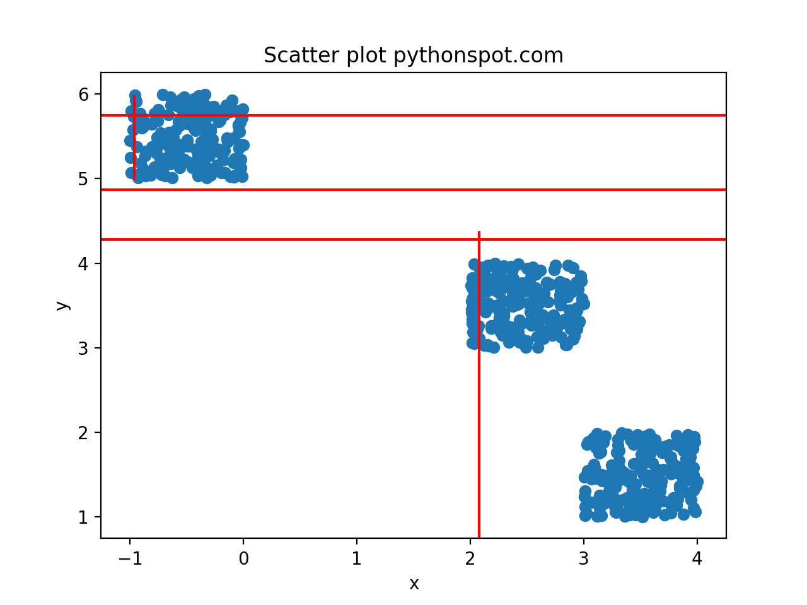

# CIKM (Not final, so, some stuff might be messy)

## So This is the folder that contains all our code for the paper we want to submit to CIKM. The CRL folder contains the code for different cases. Each case has its own folder.  
## To run any experiment, all you have to do is go to the numbered folders in CRL, and run the ipython notebook.
At the present there are three folders.  
The first one is just a test case, that we can do to see if ddpg is working. This is quite trivial, and will just help us provide a baseline for the second experiment.
The second experiment has my implementation of the ddpg algorithm. This is also tested on the same environment as the first folder (Bipedal). If this has a similar performance, then we can conclude that my ddpg implementation is correct.  
The third folder has My ClusterWorld Code and my ddpg implementation.  

